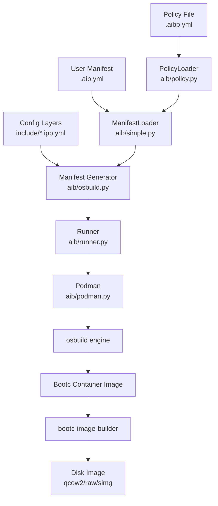
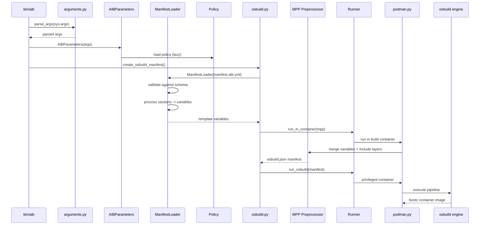
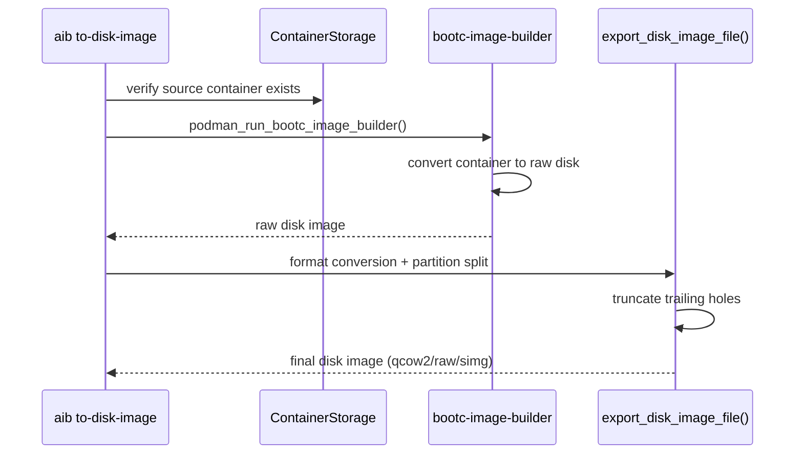
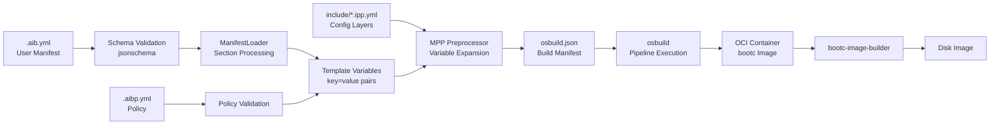

# Automotive Image Builder (AIB)

> CLI tool that builds bootc-based immutable OS images and traditional disk images for automotive and embedded systems, using osbuild as the underlying image construction engine.

- **Type:** CLI tool (image builder)
- **Primary language:** Python 3
- **Key frameworks:** osbuild (image construction), podman (container ops), jsonschema (manifest validation)
- **Version:** 1.3.0
- **License:** Apache-2.0
- **Status:** Active development — 2,936 commits over 4.5 years

## Contents

- [Architecture Overview](#architecture-overview)
- [Project Structure](#project-structure)
- [Key Components](#key-components)
- [Data Flow](#data-flow)
- [External Integrations](#external-integrations)
- [Development Guide](#development-guide)
- [Critical Paths & Gotchas](#critical-paths--gotchas)

## Architecture Overview

Layered pipeline architecture: a high-level YAML manifest (`.aib.yml`) is parsed and validated against a JSON schema, then merged with a hierarchical configuration system (distro + target + arch defaults) to produce template variables. These variables feed into osbuild's manifest pre-processor (MPP) to generate a low-level osbuild JSON manifest, which osbuild then executes inside a privileged container to produce a bootc container image. Optionally, the container is converted to a disk image via bootc-image-builder.

The design separates user-facing concerns (manifest schema, policy enforcement) from execution concerns (container orchestration, privilege escalation), allowing the same manifest to target different hardware boards and distributions by swapping configuration layers.

### System Diagram



### Design Patterns

- **Decorator-based command registry**: Functions decorated with `@command()` in `aib/arguments.py` are auto-registered into grouped subcommands with argument definitions. Name is derived from function name (`build_builder` -> `build-builder`).
- **Hierarchical configuration layering**: Build variables are resolved through a chain: `defaults.ipp.yml` -> `distro/*.ipp.yml` -> `targets/*.ipp.yml` -> `arch-*.ipp.yml` -> user manifest -> `computed-vars.ipp.yml`. Each layer can override previous values.
- **Context managers for resource cleanup**: `PodmanImageMount`, `TemporaryContainer`, `SudoTemporaryDirectory` ensure containers, mounts, and temp dirs are always cleaned up, even when builds fail.
- **Policy injection at build time**: Policies are loaded once, then injected as variable overrides and validation constraints. Target-specific overrides use `@target` suffix syntax (e.g., `allow@rpi4`).

### Key Architectural Decisions

- **osbuild as execution engine**: All filesystem operations happen inside osbuild's sandboxed pipelines, not directly on the host. This provides reproducibility and security isolation.
- **bootc over traditional images**: The primary output is an OCI container image with ostree-based atomic updates, not a traditional mutable rootfs. Traditional `aib-dev` mode exists for development convenience.
- **Privilege escalation via Runner**: Instead of requiring the tool to run as root, `Runner` manages sudo with a keepalive thread and delegates privileged operations to podman containers. Rootless mode is supported via `--user-container`.

## Project Structure

```
automotive-image-builder/
├── bin/
│   ├── aib                      -> entry point, bootstraps aib/main.py
│   ├── aib-dev                  -> entry point, bootstraps aib/main_dev.py
│   └── air                      -- run disk image in QEMU VM
├── aib/                         -- core Python package
│   ├── __init__.py              -- AIBParameters dataclass, policy resolution, logging
│   ├── main.py                  -> primary CLI: build, to-disk-image, signing ops
│   ├── main_dev.py              -> dev CLI: traditional package-based images
│   ├── arguments.py             -- @command decorator, argument parsing, CLI groups
│   ├── simple.py                -- ManifestLoader, Contents, path validation
│   ├── osbuild.py               -- osbuild manifest generation and execution
│   ├── podman.py                -- container ops: mount, run, storage, skopeo
│   ├── policy.py                -- PolicyLoader, restriction enforcement
│   ├── runner.py                -- Runner: privilege escalation, container execution
│   ├── utils.py                 -- disk formats, key handling, filesystem ops
│   ├── exceptions.py            -- 18 domain-specific exception classes
│   ├── globals.py               -- default distro/target/container image constants
│   └── tests/                   -- 13 pytest unit test modules
├── include/                     -- hierarchical config layers (.ipp.yml)
│   ├── defaults.ipp.yml         -- baseline variable defaults
│   ├── computed-vars.ipp.yml    -- post-selection derived variables
│   ├── content.ipp.yml          -- partition layout, mount units, systemd config
│   └── image.ipp.yml            -- low-level osbuild pipeline definitions
├── distro/                      -- distribution configs (autosd, fedora, rhivos, eln)
├── targets/                     -- hardware target configs (qemu, pc, aws, rpi4, etc.)
├── files/
│   ├── manifest_schema.yml      -- JSON schema for .aib.yml manifests
│   ├── policy_schema.yml        -- JSON schema for .aibp.yml policies
│   └── policies/                -- built-in policy files (hardened.aibp.yml)
├── mpp/                         -- osbuild manifest pre-processor utilities
│   ├── aib-osbuild-mpp          -> MPP executable wrapper
│   └── aibosbuild/util/         -- Python helpers: selinux, containers, parsing,
│                                   lvm2, checksum, bls, pe32p, rhsm, runners
├── examples/                    -- sample manifests (simple, complex, qm, containers)
├── tests/                       -- tmt-based integration tests (23 test suites)
│   ├── scripts/test-lib.sh      -- shared test assertions and VM utilities
│   └── tests/                   -- one directory per test scenario
└── contrib/                     -- secure-boot signing, android verified boot
```

## Key Components

### CLI Entry Points
**Location:** `aib/main.py`, `aib/main_dev.py`, `aib/arguments.py`
**Purpose:** Parse user commands and orchestrate the build pipeline
**Key files:**
- `arguments.py` -- `command()` decorator registers functions as CLI subcommands; `parse_args()` builds the argparse tree from `command_registry`
- `main.py` -- `build()` orchestrates the full bootc build; `to_disk_image()` converts containers to disk; `extract_for_signing()` / `inject_signed()` / `reseal()` handle secure boot workflows
- `main_dev.py` -- `build()` creates traditional package-based images for development

Two separate binaries share the same argument system: `aib` for production bootc images, `aib-dev` for mutable dev images. Commands are grouped via `CommandGroup` enum (BASIC, BOOTC, OTHER).

### ManifestLoader (Manifest Processing)
**Location:** `aib/simple.py`
**Purpose:** Parses `.aib.yml` manifests, validates against schema, and generates osbuild template variables
**Key files:**
- `simple.py` -- `ManifestLoader` validates manifests against `files/manifest_schema.yml`, then processes each section through dedicated handlers:
  - `handle_network()` -- static IP or dynamic (NetworkManager) configuration
  - `handle_auth()` -- root password, SSH keys, user/group creation, sshd settings
  - `handle_kernel()` -- kernel package selection, cmdline args, module deny/allow lists
  - `handle_image()` -- image sizing, partition layout, SELinux mode, hostname, ostree ref
- `simple.py` -- `Contents` class processes the `content:` section: RPM lists, repository enablement, file operations (`add_files`, `make_dirs`, `add_symlinks`, `remove_files`, `chmod_files`, `chown_files`), container image embedding, and systemd service management. `QMContents` extends it for the QM partition with the same interface.
- `simple.py` -- `ExtraInclude` handles file embedding with glob pattern support (`**/*` recursion), three path modes (flattened, preserved, relative), `max_files` safety limits, and `allow_empty` flag
- `simple.py` -- `ValidatedPathOperation` enum enforces that file operations only target allowed paths: `ADD_FILES` allows `/etc/`, `/usr/`; `MAKE_DIRS` also allows `/var/`; all operations block `/etc/passwd`, `/etc/group`, `/etc/shadow`
- `simple.py` -- `parse_size()` converts human-readable sizes ("4GB", "512MiB") to bytes, used throughout for image and partition sizing

See `aib/tests/simple_test.py` (1,557 lines) for comprehensive edge case coverage and `examples/complex.aib.yml` for a full manifest example.

### Policy System
**Location:** `aib/policy.py`, `aib/__init__.py`
**Purpose:** Enforces organizational constraints on builds
**Key files:**
- `policy.py` -- `PolicyLoader` validates `.aibp.yml` files against `files/policy_schema.yml`; `Policy` class enforces restrictions via `validate_build_args()` (modes, targets, distros, architectures) and `validate_manifest()` (RPMs, kernel modules, manifest properties)
- `__init__.py` -- `AIBParameters.policy` resolves policy files from three locations: current directory, system-wide policies directory, and `files/policies/` within the project

Policies support target-specific overrides with `@target` suffix: `allow@rpi4`, `disallow@qemu`. See `files/policies/hardened.aibp.yml` for the built-in security policy and `aib/tests/policy_test.py` for validation scenarios.

### osbuild Integration
**Location:** `aib/osbuild.py`
**Purpose:** Generates and executes osbuild manifests
**Key files:**
- `osbuild.py` -- `create_osbuild_manifest()` combines user manifest variables with the hierarchical config layers and runs the MPP pre-processor to produce a final osbuild JSON manifest
- `osbuild.py` -- `run_osbuild()` executes osbuild with caching, checkpoints, and progress monitoring
- `osbuild.py` -- `export_disk_image_file()` exports disk images with optional per-partition splitting and truncation of trailing holes
- `osbuild.py` -- `validate_builddir()` rejects NFS/AFS filesystems that are incompatible with osbuild

### Runner (Execution Orchestration)
**Location:** `aib/runner.py`
**Purpose:** Abstracts execution contexts: host vs. container, root vs. user
**Key files:**
- `runner.py` -- `Runner` class provides `run_as_root()`, `run_in_container()`, and `run_as_user()` with automatic privilege management
- `runner.py` -- `ensure_sudo()` maintains a keepalive thread that periodically refreshes sudo credentials
- `runner.py` -- `Volumes` tracks bind mounts for container builds

### Container Operations
**Location:** `aib/podman.py`
**Purpose:** Low-level podman/skopeo interactions
**Key files:**
- `podman.py` -- `ContainerStorage` manages custom storage locations; `ContainerState` detects rootless/containerized environments
- `podman.py` -- `PodmanImageMount` (context manager) mounts/unmounts container images for inspection
- `podman.py` -- `TemporaryContainer` (context manager) creates ephemeral containers that are auto-removed
- `podman.py` -- `podman_run_bootc_image_builder()` runs bootc-image-builder for container-to-disk conversion

### Hierarchical Configuration System
**Location:** `include/`, `distro/`, `targets/`
**Purpose:** Layered variable resolution that adapts builds to different distros and hardware
**Key files:**
- `include/defaults.ipp.yml` -- baseline defaults for all builds: kernel package (`kernel-automotive`), 8GB image size, UKIboot, composefs enabled, SELinux enforcing, IPv6 disabled, systemd timeouts, dracut modules, base RPM list
- `distro/*.ipp.yml` -- distro-specific repos, GPG keys, SELinux policies. 10 distros supported:
  - AutoSD: `autosd.ipp.yml`, `autosd10.ipp.yml`, `autosd10-sig.ipp.yml`, `autosd10-latest-sig.ipp.yml`
  - Fedora: `f43.ipp.yml`
  - ELN: `eln.ipp.yml`
  - RHIVOS: `rhivos-2.ipp.yml`, `rhivos-2.0.ipp.yml`, `rhivos-core-2.ipp.yml`, `rhivos-core-2.0.ipp.yml`
- `targets/*.ipp.yml` -- hardware-specific drivers, consoles, boot mechanisms. 18 targets:
  - Virtual: `qemu` (virtio, UKIboot), `abootqemu`, `abootqemukvm` (android boot)
  - Cloud: `aws`, `azure`
  - x86: `pc`
  - ARM boards: `rpi4`, `beagleplay`, `am62sk`, `am69sk`, `tda4vm_sk`, `j784s4evm`, `ebbr`, `ccimx93dvk`, `imx8qxp_mek`
  - Qualcomm: `ride4_sa8775p_sx`, `ride4_sa8775p_sx_r3`, `ride4_sa8650p_sx_r3`
- `include/computed-vars.ipp.yml` -- complex derived variables computed after all layers merge: `/var` partition sizing (relative calculations), UUID derivation, kernel cmdline composition (20+ conditional flags), dracut module lists, enabled systemd services, SELinux boolean aggregation
- `include/content.ipp.yml` -- generates partition layouts (GPT table definition), systemd mount units, ostree-prepare-root.conf, containers.conf, repart configs, nmstate network definitions
- `include/data.ipp.yml` -- static system data: base users/groups with hard-coded UIDs for reproducibility
- `include/image.ipp.yml` -- low-level osbuild pipeline stages: disk truncation, sfdisk partitioning, mkfs, loopback devices, LUKS2, LVM2, composefs

Resolution order: defaults -> data -> distro -> target -> arch -> user manifest -> computed variables -> policy enforcement.

### Quality Management (QM) Partition System
**Location:** `aib/simple.py` -> `QMContents`, `include/qm.ipp.yml`, `include/content.ipp.yml`
**Purpose:** Builds an isolated secondary partition for quality-managed code separation
**Key files:**
- `simple.py` -- `QMContents` extends `Contents` for QM-specific content; `ManifestLoader.handle_qm()` processes memory/CPU limits and container checksum validation
- `include/qm.ipp.yml` -- dedicated osbuild pipeline that builds a separate rootfs mounted at `/usr/share/qm/rootfs`
- Manifest `qm:` section supports its own RPMs, container images, files, and systemd services independent of the main image
- Resource limits (`memory_max`, `memory_high`, `cpu_weight`) translate to systemd cgroup settings

See `examples/qm.aib.yml` for usage and `tests/tests/memory-limit-cpu-weight/` for resource limit validation.

### Secure Boot and Signing
**Location:** `aib/main.py`, `aib/utils.py`, `contrib/secure-boot/`, `contrib/avb/`
**Purpose:** EFI SecureBoot and Android Verified Boot signing workflows
**Key files:**
- `main.py` -- `extract_for_signing()` extracts EFI/aboot binaries from built images; `inject_signed()` injects signed binaries back; `reseal()` / `prepare_reseal()` handle ostree sealing with new keys
- `utils.py` -- `read_public_key()`, `read_keys()`, `generate_keys()` for ed25519 key pair handling; `detect_initrd_compression()` and `create_cpio_archive()` for initramfs manipulation
- `contrib/secure-boot/` -- signing infrastructure and pregenerated test keys
- `contrib/avb/` -- Android Verified Boot tooling

### Component Interaction -- Build Flow



### Disk Image Conversion Flow



## Data Flow

User-authored `.aib.yml` manifests flow through a multi-stage transformation: schema validation -> section processing -> variable generation -> MPP template expansion -> osbuild JSON manifest -> osbuild execution -> OCI container image -> optional disk image conversion.

### Manifest Transformation Pipeline



### Key Data Transformations
- `.aib.yml` YAML -> `ManifestLoader` -> dictionary of osbuild template variables (e.g., `extra_rpms`, `image_size`, `selinux_mode`)
- Template variables + `include/*.ipp.yml` -> MPP preprocessor (`mpp/aib-osbuild-mpp`) -> full osbuild JSON manifest with pipeline stages
- osbuild pipeline stages -> osbuild engine -> ostree-based filesystem in OCI container format
- OCI container -> bootc-image-builder -> partitioned disk image (GPT table, EFI, boot, root, var)
- Raw disk image -> `DiskFormat` conversion (`aib/utils.py`) -> qcow2 (QEMU), simg (Android sparse), or split per-partition files

### Variable Categories
The configuration system manages hundreds of variables across these categories:
- **Kernel**: package name, version, cmdline flags, module signing, dracut modules/drivers
- **Partitions**: sizes (absolute/relative), UUIDs, filesystem types, GPT type GUIDs
- **Network**: DHCP vs static, interface names, DNS, gateway, nmstate configs
- **Security**: SELinux mode/booleans, module signature enforcement, LUKS encryption
- **Systemd**: enabled/disabled/masked services, timeouts, cgroup settings
- **Content**: RPM lists, repository URLs, container images, file embeddings
- **Build**: osbuild cache settings, build container selection, build RPM dependencies

## External Integrations

| Tool | Purpose | Interface Location | Required |
|------|---------|-------------------|----------|
| osbuild | Image construction engine | `aib/osbuild.py` -> `run_osbuild()` | Yes |
| podman | Container build/run/mount/storage | `aib/podman.py` | Yes |
| skopeo | Container image copying between transports | `aib/main.py` -> `bootc_archive_to_store()` | Yes |
| bootc-image-builder | Container-to-disk conversion | `aib/podman.py` -> `podman_run_bootc_image_builder()` | For disk images |
| QEMU | VM testing of built images | `bin/air`, `tests/scripts/test-lib.sh` | For testing |
| openssl | Key generation for secure boot | `aib/utils.py` -> `generate_keys()` | For signing |
| dnf | Package resolution and download | Via osbuild pipelines | Yes (inside build) |

### Configuration
- Default distro: `autosd10-sig` (set in `aib/globals.py`)
- Default target: `qemu` (set in `aib/globals.py`)
- Build container image: `quay.io/centos-sig-automotive/automotive-image-builder`
- bootc-image-builder: `quay.io/centos-bootc/bootc-image-builder:latest`
- Environment variable overrides: `AIB_CONTAINER_IMAGE`, `AIB_CONTAINER_STORAGE`, `AIB_BIB_CONTAINER_IMAGE`, `OSBUILD_BUILDDIR`

## Development Guide

### Prerequisites
- Python 3
- podman
- osbuild (>= 172)
- Root access or sudo (for privileged builds)

### Key Commands
| Command | Purpose |
|---------|---------|
| `make test-unit` | Run pytest with 70% coverage threshold |
| `make test-integration` | Run full tmt integration suite |
| `make test-integration-parallel` | Run integration tests (5 concurrent) |
| `make test` | Run unit tests + integration tests + yamllint |
| `tox -e lint` | Run flake8 + pylint |
| `tox -e format` | Auto-format with black |
| `make yamllint` | Validate YAML files |
| `make shellcheck` | Validate shell scripts |
| `make rpm` | Build release RPM |
| `make generate-manifest-doc` | Generate schema documentation |

Single integration tests can be run via the `test-integration-%` pattern target:
`make test-integration-selinux-config`, `make test-integration-minimal-image-boot`, etc.

### Testing
- **Unit tests** (`aib/tests/`): 13 pytest modules, ~5,400 lines. Coverage threshold: 70%. Key test files:
  - `simple_test.py` (1,557 lines) -- manifest parsing, path validation, glob patterns, partition sizing
  - `policy_test.py` (878 lines) -- policy loading, restriction enforcement, target-specific overrides
  - `utils_test.py` (855 lines) -- file utilities, disk format handling
  - `runner_test.py` (581 lines) -- build orchestration, output handling
  - `manifest_test.py` (442 lines) -- osbuild manifest rewriting, path transformations
- **Integration tests** (`tests/tests/`): 23 tmt-based test suites. Each has a `main.fmf` metadata file and `run-test.sh` script. Tests build real images and boot them in QEMU VMs. Key scenarios: `minimal-image-boot`, `secureboot`, `compliance-policy`, `container-image`, `network-static`, `selinux-config`, `install-rpms`, `manage-files`, `systemd-services`, `memory-limit-cpu-weight`.
- **Test library** (`tests/scripts/test-lib.sh`): 50+ assertion functions for strings, files, JSON, systemd services, partition sizes. VM management: `run_vm()`, `wait_for_vm_up()`, `run_vm_command()`, `stop_vm()`.
- **Test plans** (`tests/plans/`): `local.fmf` for local execution with sudo, `connect.fmf` for remote SSH execution on pre-provisioned machines.
- **CI**: GitLab CI with pre-stage linting, unit tests, integration tests on AWS (via Duffy with `ci-scripts/parallel-test-runner.sh`), multi-arch container builds, and documentation deployment.

### Code Quality
- **Formatting**: black (enforced)
- **Linting**: flake8 (E501/W503/E203 ignored)
- **Shell**: shellcheck
- **YAML**: yamllint

See `CLAUDE.md` for build examples and `README.md` for user-facing documentation.

## Critical Paths & Gotchas

### Areas Requiring Extra Caution
- **Path validation** (`aib/simple.py` -> `Contents.validate_paths()`): File operations in manifests are restricted to `/etc/`, `/usr/`, and `/var/` with specific exclusions. Bypassing this is a security boundary.
- **Privilege escalation** (`aib/runner.py` -> `Runner`): sudo keepalive thread, rootless vs. rootful detection, and container privilege flags must all align. Incorrect configuration silently produces broken images.
- **Variable resolution order** (`include/computed-vars.ipp.yml`): Variables computed from other variables depend on strict ordering. Moving a variable definition to the wrong layer can cascade into incorrect partition sizes, kernel cmdlines, or mount configurations.
- **Policy `@target` overrides** (`aib/policy.py`): Target-specific allow/disallow rules are evaluated with suffix matching. A typo in the target name silently falls through to the default rule.

### Common Mistakes
- **NFS/AFS build directories**: osbuild fails silently on network filesystems. `validate_builddir()` in `aib/osbuild.py` now checks for this, added after repeated incidents (commit `b3295d6`).
- **UID/GID collisions in manifests**: Custom users/groups that conflict with the base system data in `include/data.ipp.yml` cause cryptic build failures. The `minimal-image-boot` integration test validates this.
- **Missing build container**: Building requires a pre-built helper container (`aib build-builder`). Without it, the build fails with `BuildContainerNotFound`. The error message includes the fix command.

### Exception Hierarchy
All domain exceptions inherit from `AIBException` in `aib/exceptions.py`. Key exceptions to know:
- `SimpleManifestParseError` -- schema validation failures, includes all validation errors
- `InvalidTopLevelPath` -- security boundary: file operation targets a forbidden path
- `ContainerNotFound` / `BuildContainerNotFound` -- missing container images (includes remediation steps)
- `IncompatibleOptions` -- mutually exclusive CLI flags
- `NoMatchingFilesError` / `TooManyFilesError` -- glob pattern safety limits

### Where to Start
Recommended reading order for a new developer:
1. `bin/aib` -- see how the CLI bootstraps (path setup, imports `aib/main.py`)
2. `aib/arguments.py` -- understand the `@command` decorator and how CLI commands are registered
3. `aib/main.py` -> `build()` -- follow the main build flow from CLI to container output
4. `aib/simple.py` -> `ManifestLoader` -- how user manifests are parsed and converted to variables
5. `aib/osbuild.py` -> `create_osbuild_manifest()` -- how variables become an executable osbuild manifest
6. `examples/complex.aib.yml` -- see a full manifest with all available sections
7. `include/defaults.ipp.yml` -- understand the variable system and default values

---
<!-- USER NOTES - content below this line is preserved on updates -->

## Additional Notes

[Space for team members to add domain context, corrections, or supplementary notes.
This section is never overwritten by automated updates.]
